# Deploying Portal 10.x on Azure Server running CentOS 7

Assumes you already have created a DCOS cluster.

## Add a new server to the Resource Group

Click Add

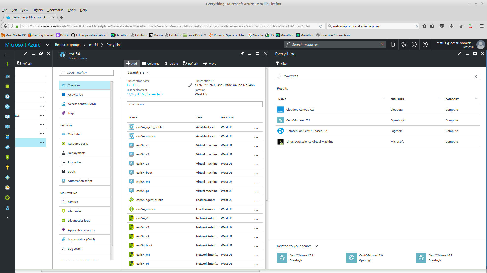

Search for CentOS 7.2

Select CentOS-based 7.2 OpenLogic

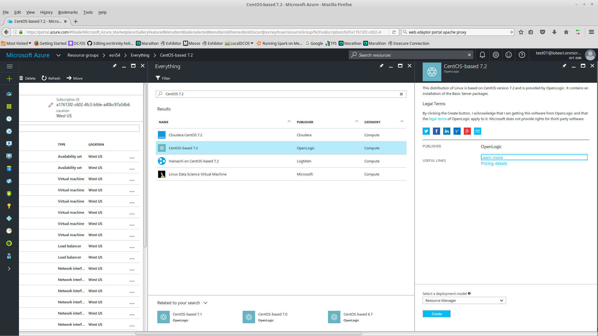

Select Create

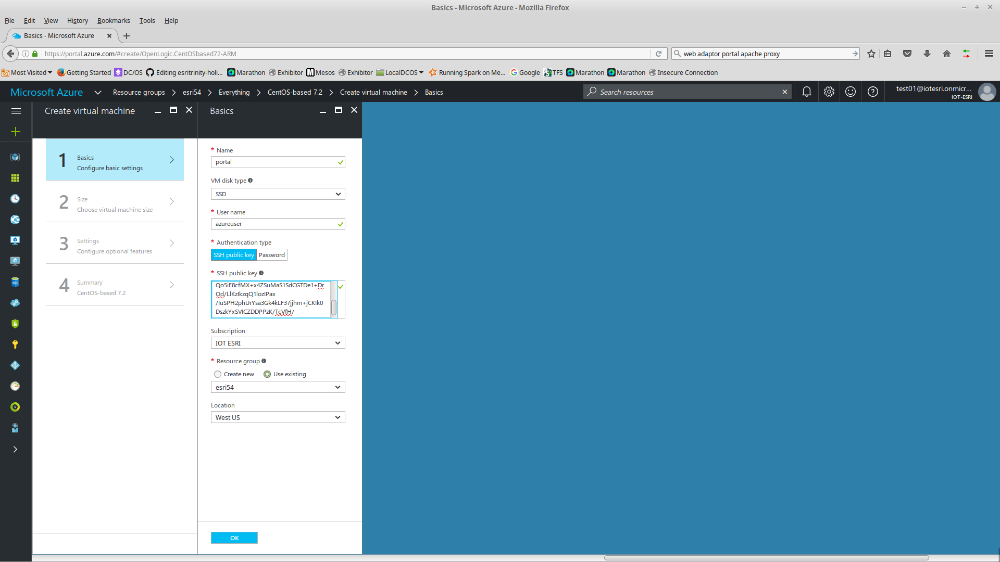

Enter Values
- Name: portal
- User name: azureuser
- SSH public key: (cut and paste)

Click OK

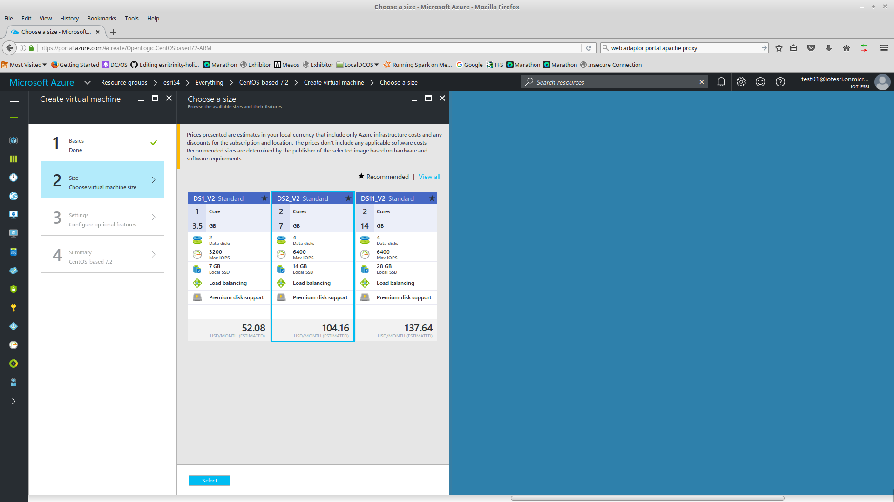

Select a size (e.g. DS2_V2); Click Select

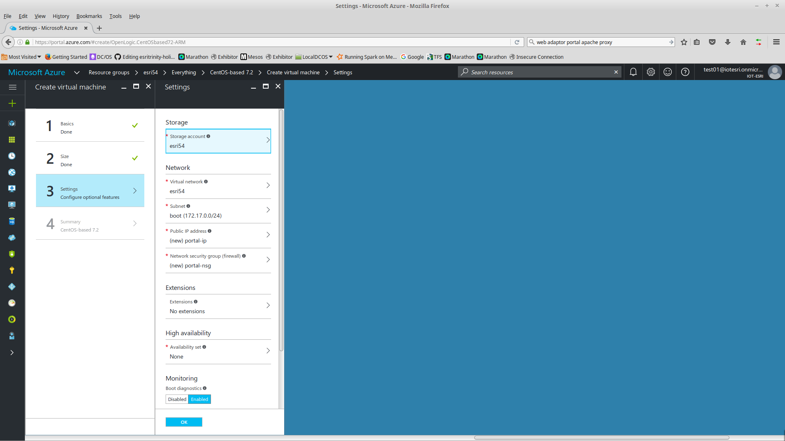

Enter Values
- Storage: esri54  (The one used for all the other servers)
- Subnet: boot will work fine.

Defaults will create a new Public IP, NSG.

Click OK

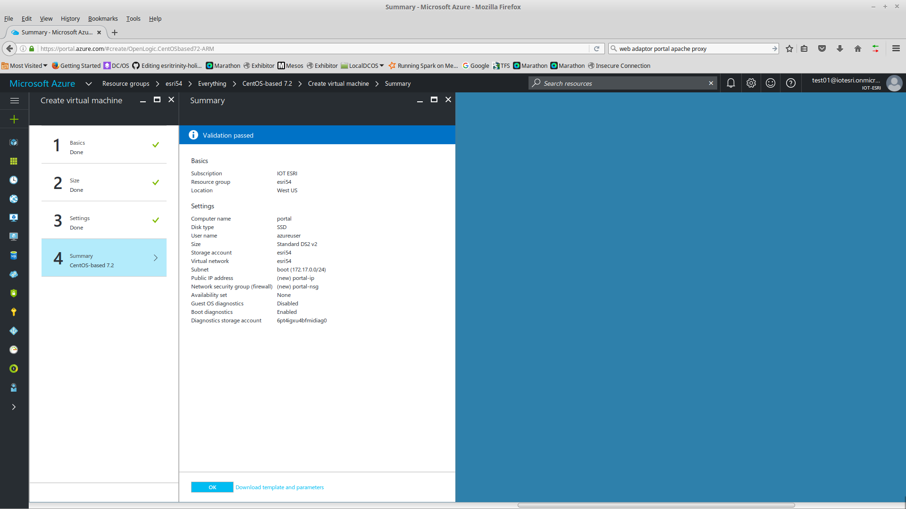

Click OK

It will take a couple of minutes for the new server to be created.  You'll see a message when it's done.

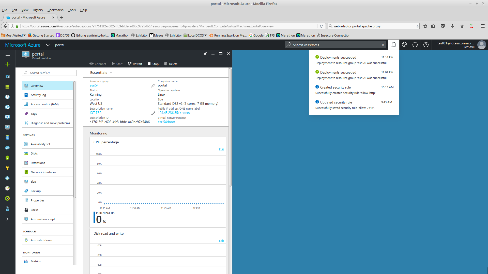

From the Resource Group search for portal

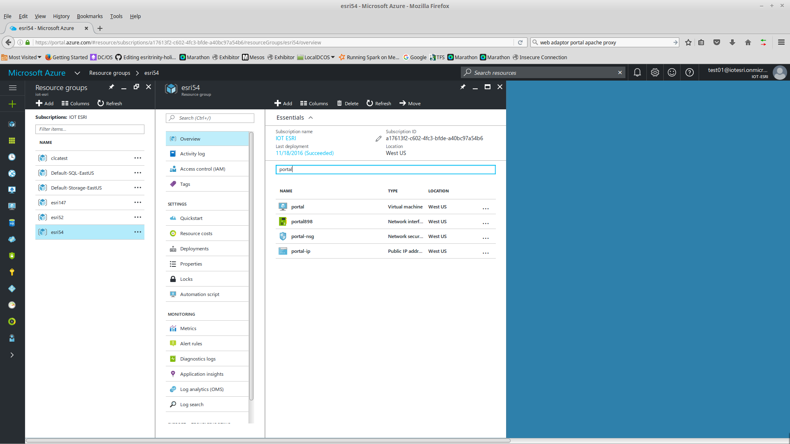

Click on portal-ip

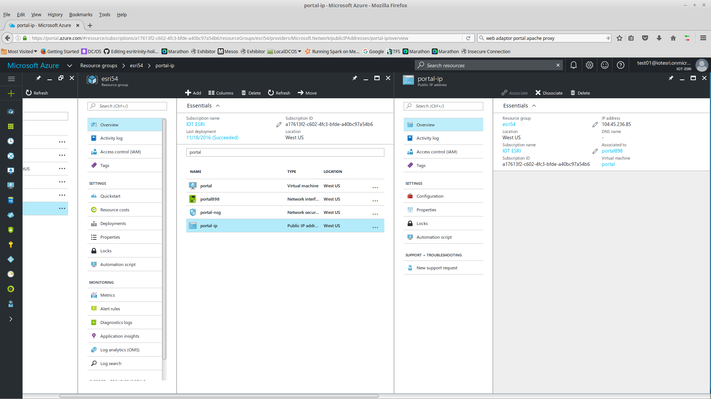

Click on Configuration

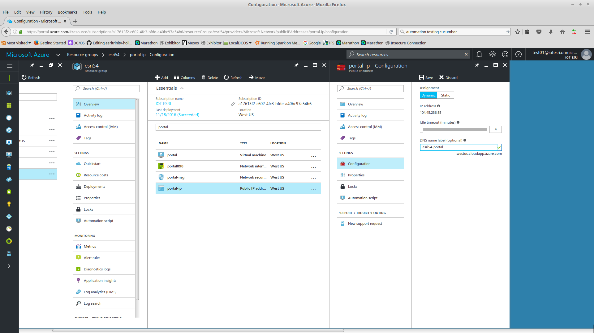

Set a DNS name for the public IP

esri54-portal

The full DNS entry will be: esri54-portal.westus.cloudapp.azure.com

Click Save

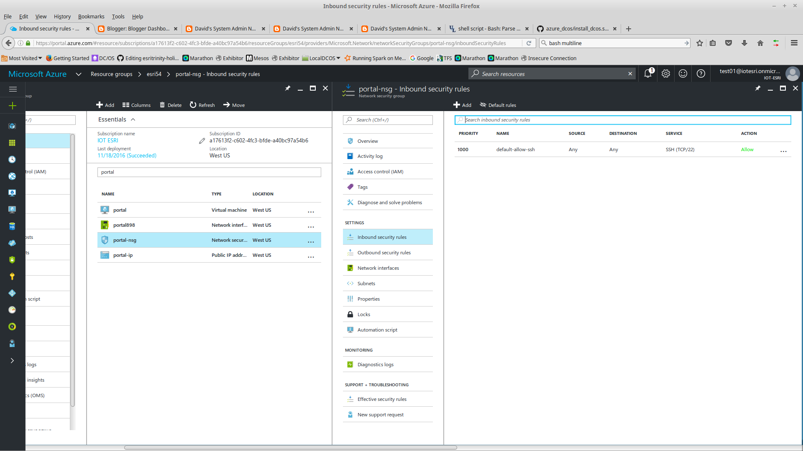

Under portal-nsg add Inbound security rules to allow http, https, and 7443.

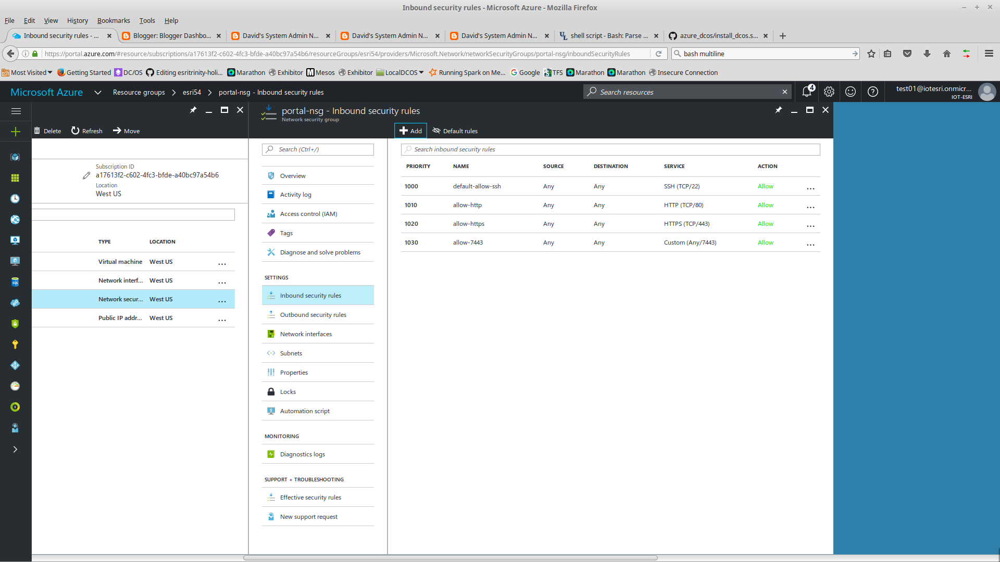

## Upload Installation Media

I recommend using rsync. The rsync command will allow you to resume an upload if it fails.

<pre>
$ rsync -avHPe "ssh -i azureuser" /media/david/Web_Adaptor_Java_Linux_1041_152000.tar.gz  azureuser@104.45.236.85:.
$ rsync -avHPe "ssh -i azureuser" /media/david/Portal_for_ArcGIS_Linux_1041_151999.tar.gz azureuser@104.45.236.85:.
$ rsync -avHPe "ssh -i azureuser" /media/david/Portal_100.ecp azureuser@40.118.247.245:.
</pre>

While this is uploading you can install prerequisites.

## Install Prerequisites on Server

Login to the portal server

<pre>
$ ssh -i azureuser azureuser@104.45.236.85
</pre>

Switch user to root

<pre>
$ sudo su -
</pre>

Set hostname

<pre>
# hostnamectl set-hostname esri54-portal.westus.cloudapp.azure.com

# echo "$(hostname -I) $(hostname)" >> /etc/hosts
</pre>

Install Software

<pre>
# yum groupinstall -y x11
# yum install -y dos2unix
# yum install -y httpd
# yum install -y mod_ssl
# yum install -y java-1.8.0-openjdk

# useradd arcgis

# sed -i '/#@student.*maxlogins.*/aarcgis soft nofile 65535\narcgis hard nofile 65535\narcgis soft nproc 25059\narcgis hard nproc 25059' /etc/security/limits.conf 

# proxy_conf="ProxyRequests off 

ProxyPass /portal ajp://localhost:8009/portal
ProxyPassReverse /portal ajp://localhost:8009/portal

RewriteEngine On
RewriteCond %{HTTPS} !=on
RewriteRule (.*) https://%{SERVER_NAME}/\$1 [R,L]"

# echo "$proxy_conf" > /etc/httpd/conf.d/proxy.conf

# systemctl enable httpd
# systemctl start httpd
</pre>

After upload is complete you can move installers into arcgis's home folder.

<pre>
# mv /home/azureuser/Portal* /home/arcgis/
# mv /home/azureuser/WebAdap* /home/arcgis/
# chown arcgis. /home/arcgis/*
# su - arcgis
</pre>

## Install Portal

<pre>
$ tar xvzf Portal_for_ArcGIS_Linux_1041_151999.tar.gz
$ cd PortalForArcGIS
$ ./Setup -m silent -l yes -a /home/arcgis/Portal_100.ecp
</pre>

Navigate in browser to https://esri54-portal.westus.cloudapp.azure.com:7443/arcgis/home

Proceed past security warning about self-signed certificate.

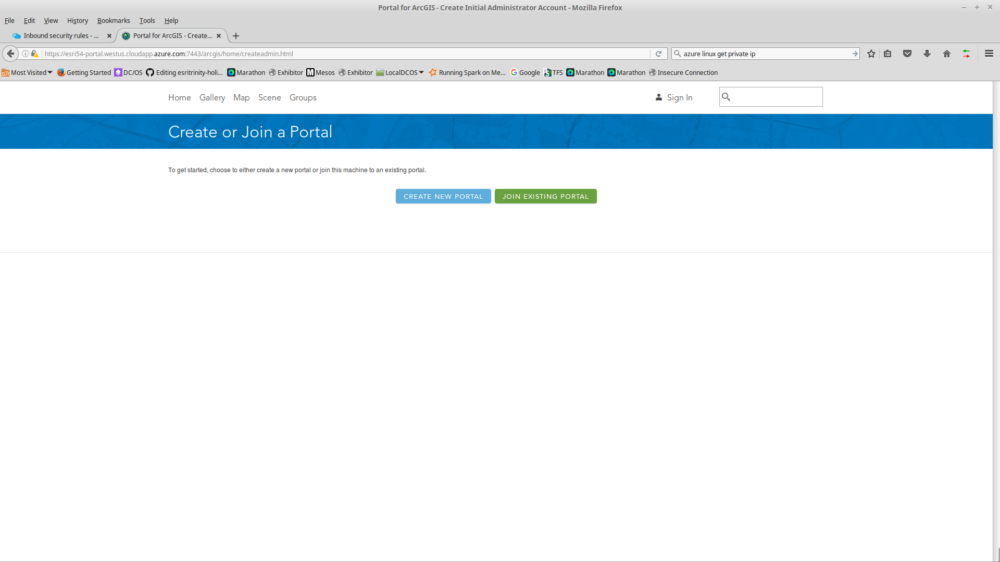

Click Create New Portal

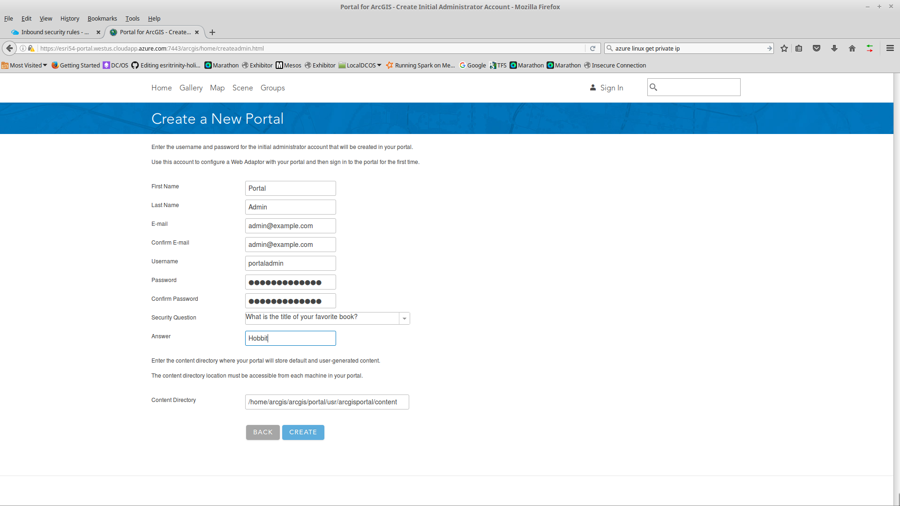

Fill in questions. 

Click Create

This can take a minute or two.

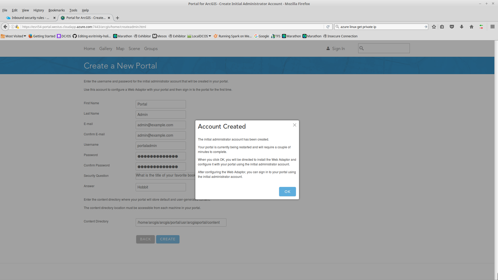

Click OK

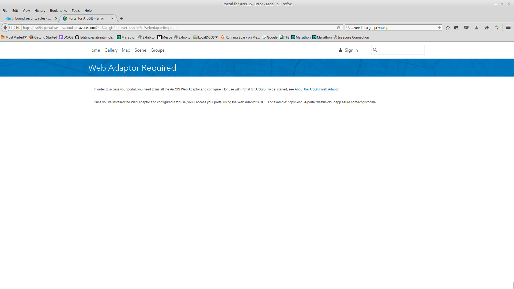

Now we'll install Tomcat and Web Adaptor.

## Install Tomcat

<pre>
$ curl -O http://www.apache.org/dist/tomcat/tomcat-8/v8.0.39/bin/apache-tomcat-8.0.39.tar.gz

$ md5sum apache-tomcat-8.0.39.tar.gz

Verify the result with what's on http://www.apache.org/dist/tomcat/tomcat-8/v8.0.39/bin/apache-tomcat-8.0.39.tar.gz.md5

$ tar xvzf apache-tomcat-8.0.39.tar.gz

$ ln -s apache-tomcat-8.0.39 tomcat8

$ /home/arcgis/tomcat8/bin/startup.sh

</pre>

## Install Web Adaptor

<pre>
$ tar xvzf Web_Adaptor_Java_Linux_1041_152000.tar.gz

$ cd WebAdaptor

$ ./Setup -m silent -l yes

$ cd ..

$ cp webadaptor10.4.1/java/arcgis.war tomcat8/webapps/portal.war

$ cd webadaptor10.4.1/java/tools/

$ ./configurewebadaptor.sh -m portal -w https://esri54-portal.westus.cloudapp.azure.com/portal/webadaptor -g https://esri54-portal.westus.cloudapp.azure.com:7443 -u portaladmin -p <PASSWORD>

</pre>

Should get message: Succesfully Registered.

Try to access from browser

As before you'll have to accept the risk to get past self-signed certs.

https://esri54-portal.westus.cloudapp.azure.com/portal/home

After you login you show see the Home page.

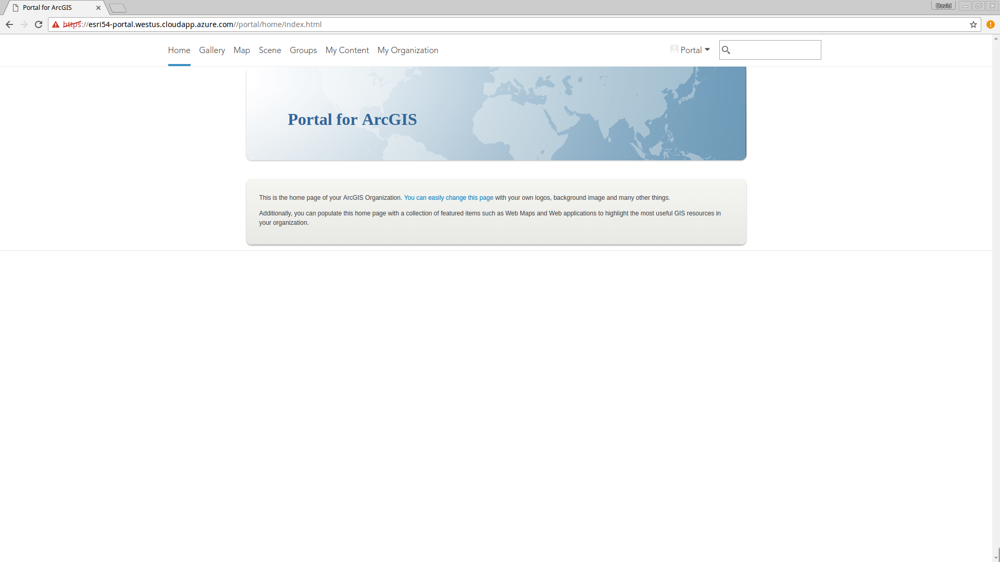

## Configure services

You'll need to configure services as root.

<pre>
# cp /home/arcgis/arcgis/portal/framework/etc/arcgisportal.service /etc/systemd/system
# systemctl enable arcgisportal

# tomcat8_service="Description=Tomcat8
After=network.target

[Service]
Type=forking
User=arcgis
Group=arcgis

ExecStart=/home/arcgis/tomcat8/bin/startup.sh
ExecStop=/home/arcgis/tomcat8/bin/shutdown.sh

[Install]
WantedBy=multi-user.target"

# echo "$tomcat8_service" > /etc/systemd/system/tomcat8.service

# systemctl enable tomcat8.service

# reboot

</pre>

After reboot verify you can still access portal in a browser.  Portal takes a couple of minutes to start.

## Done!

