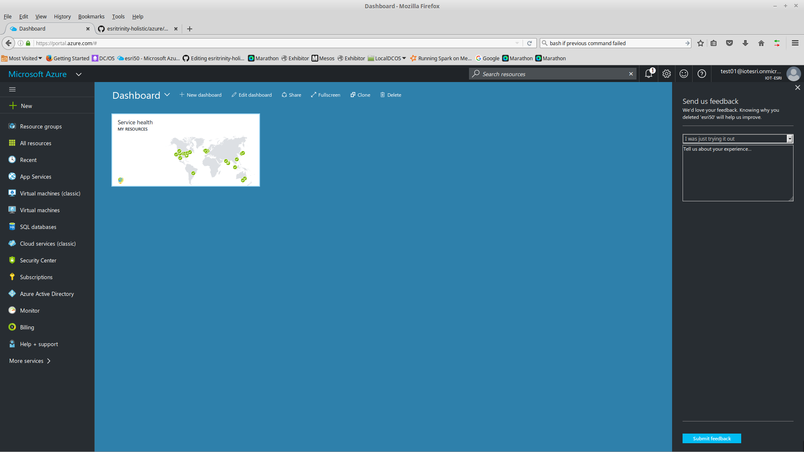
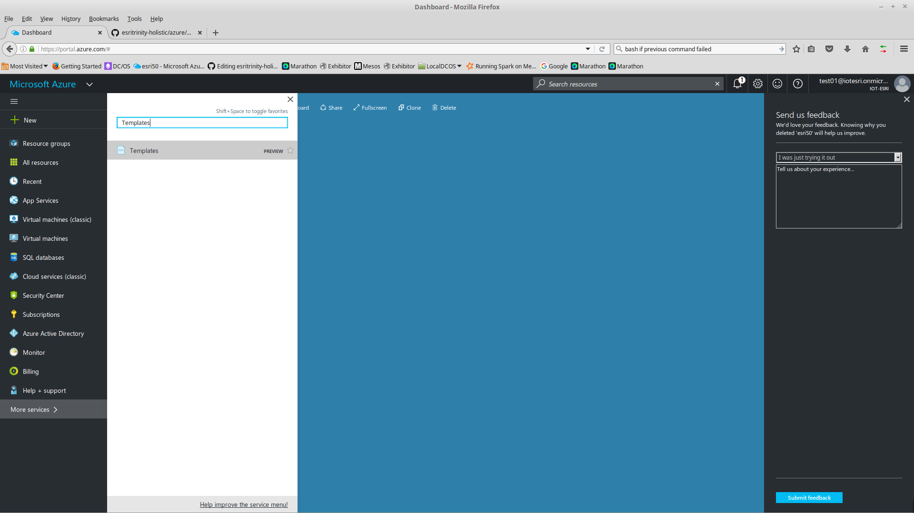
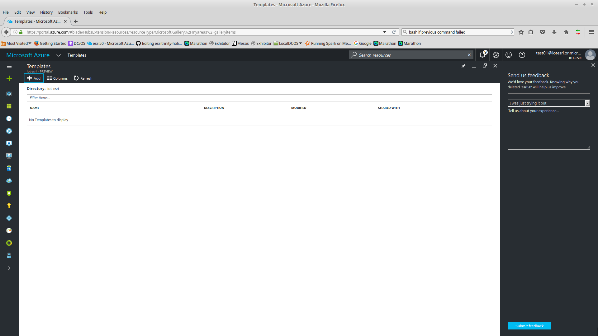
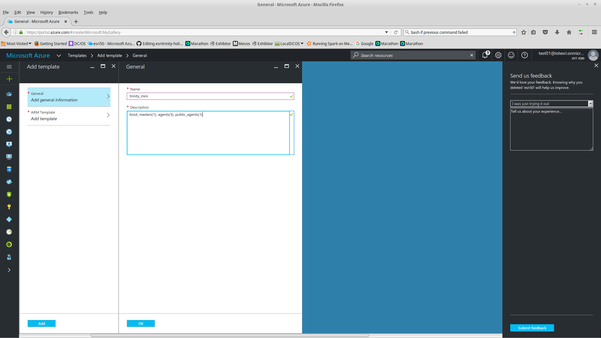
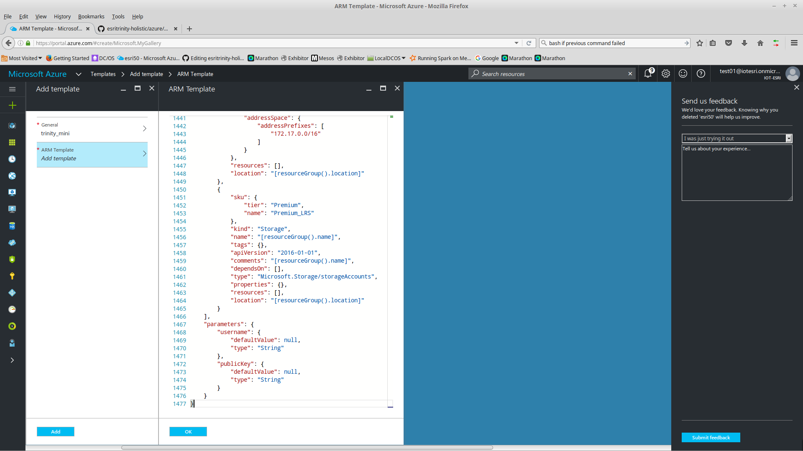
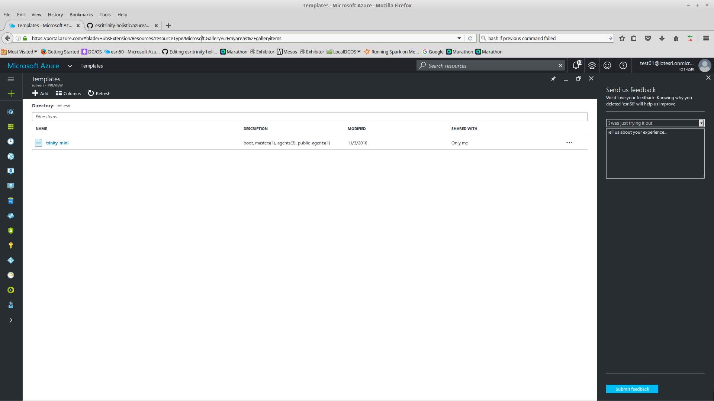
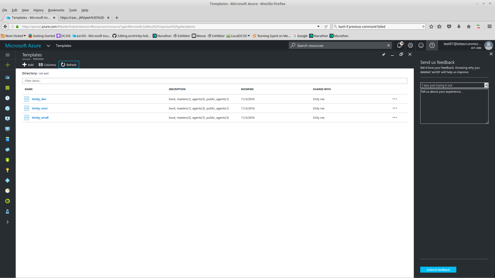

<h1>Create Template(s)</h1>

 This needs to only be done once for your user. 

<h2>Connect to Azure Portal</h2>
 

<h2>Click on More Services</h2>

Search for Templates

Select Templates

 

<h2>Click on Add</h2>
 

<h2>Enter Name and Description</h2>

Name: trinity_mini

Description: boot, masters(1), agents(3), public_agents(1)

 

Click OK

<h2>Copy the Template from Github</h2>

The Templates were created using a <a href="../../azure/arm/arm-template-generator.py"> Python Script</a>

You could use the script to create your own custom size templates.

Delete the contents of ARM Template on Azure

Copy the <a href="arm/trinity_mini.json">trinity_mini.json</a> to ARM Template on Azure

 
Click OK
Click Add
Click Refresh
 

<h2>Repeat for other types as desired (dev, small, etc.)</h2>
 

The Templates are now ready to be used

